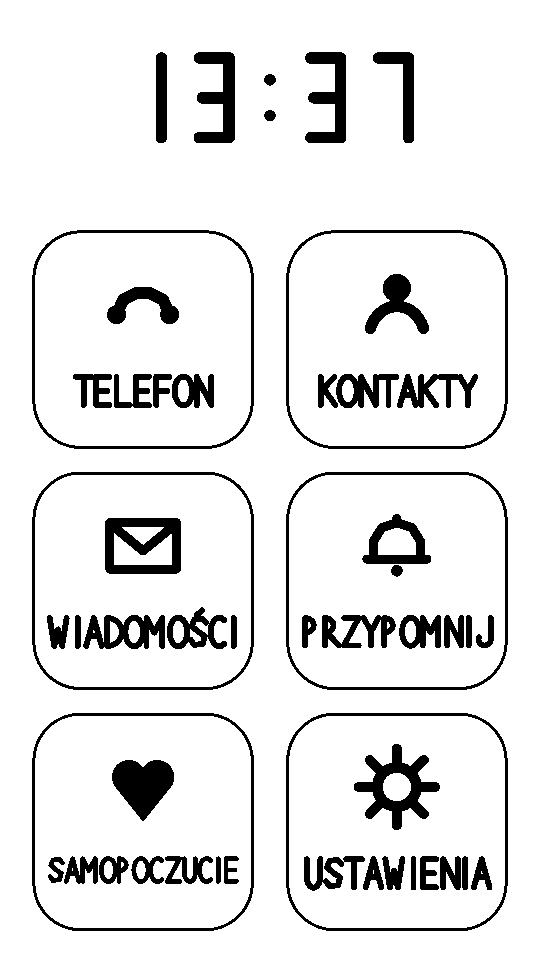
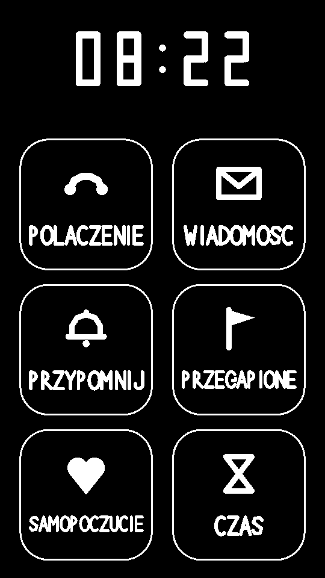
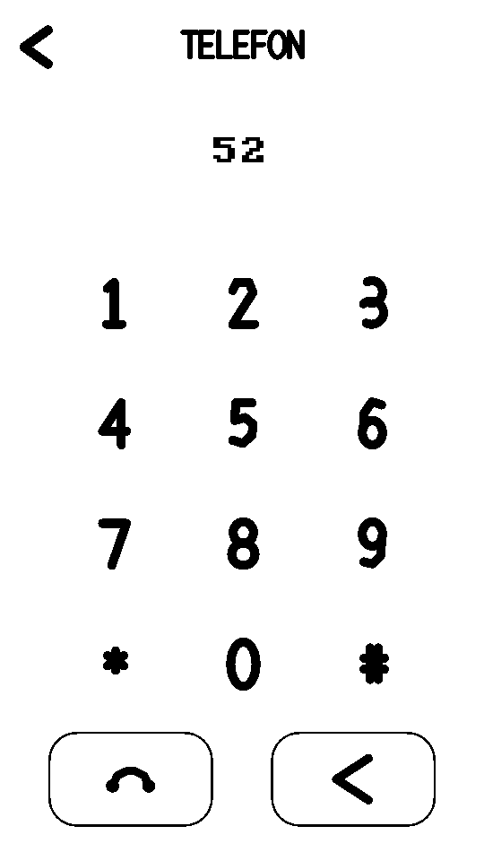
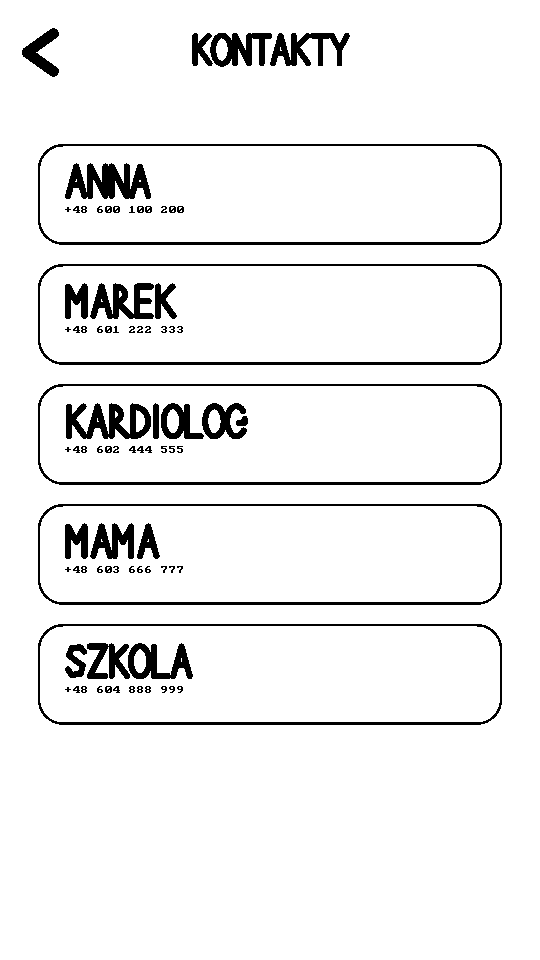
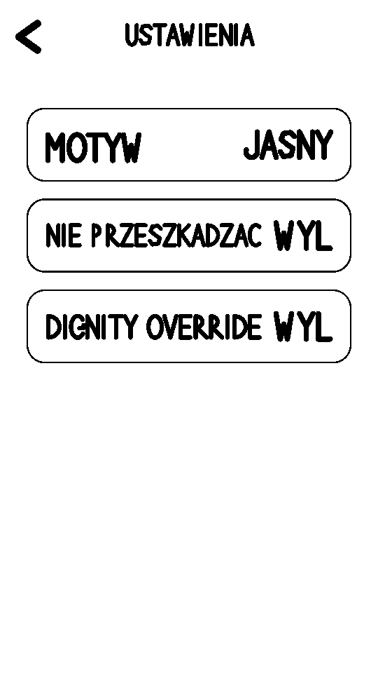
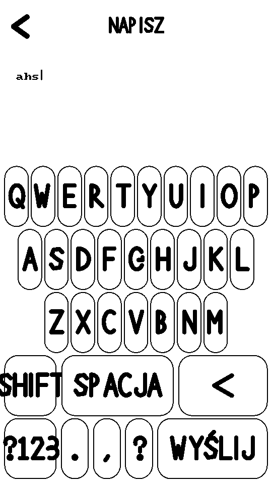
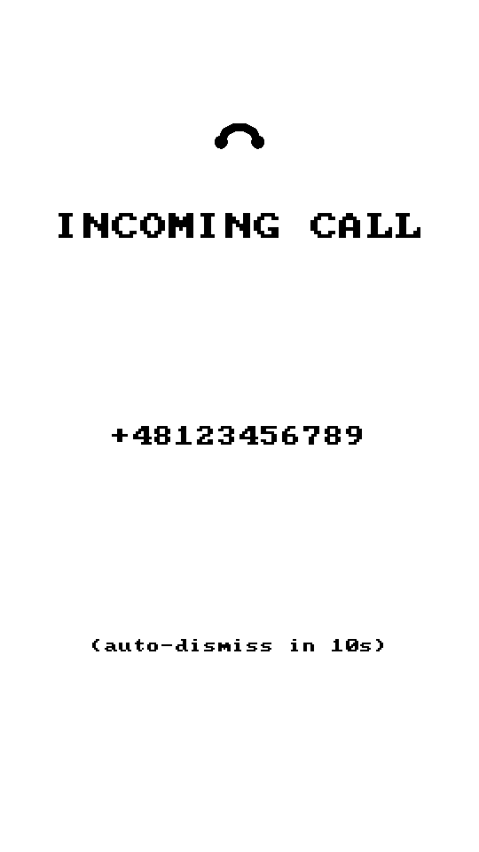
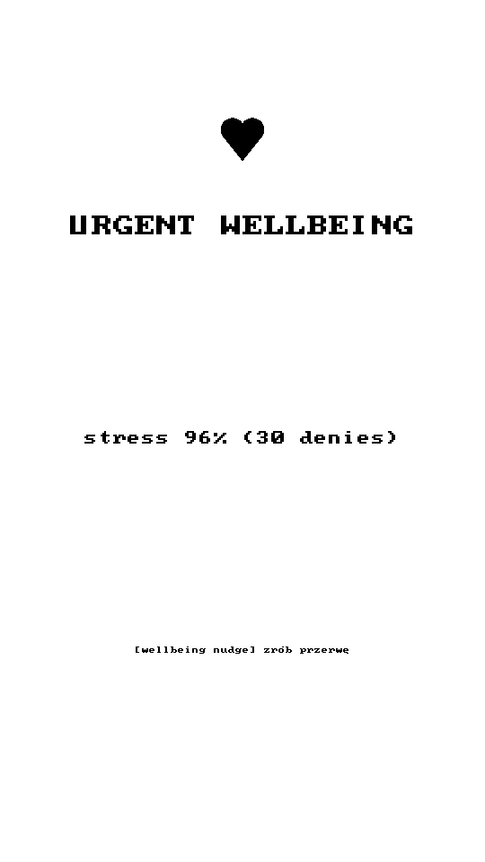
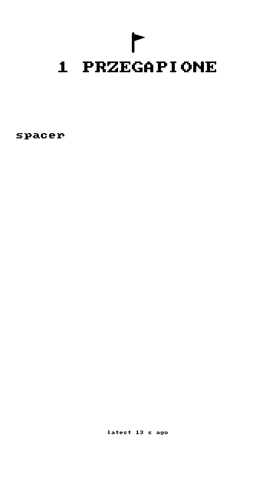
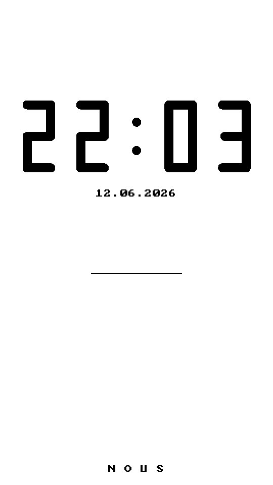

# NOUS OS

> **A reasoning operating system for phones, with built-in integrity.**
> An OS that does not betray its user — and does not betray itself either.

[](#status)
[](CHANGELOG.md)
[-lightgrey)](#source-code)
[](COPYRIGHT.md)
[](#tech-stack)
[](ROADMAP.md)

[🇵🇱 polska wersja](README.md) · 🇬🇧 English

> **This repository is a public showcase of the project.** It contains
> documentation, specifications and screenshots. **The source code stays
> private** — see [Source code](#source-code).

---

## What is this

**NOUS OS** is a personal research project — a phone operating system
designed from scratch with two uncommon constitutive choices:

1. **The system is a moral agent.** It has ethical principles built
   into hardware (DIGNITY list in TEE ROM, harm_score thresholds,
   fail-closed Ethics Gate). It enforces them **even against its own
   owner**.
2. **The system supports ADHD users without surveilling them.** All
   "wellbeing" features are **isolated from the network at compile
   time** (adding `<sys/socket.h>` to the wellbeing module is a
   compile error, not a runtime warning).

NOUS is the Greek word νοῦς — **mind, intellect, reason**. It
translates directly: **a reasoning system**. The philosophical
positioning is in [MANIFESTO.md](MANIFESTO.md) (Polish original).

---

## What works today

**27 green checkpoints** in QEMU aarch64 — full list in
[CHANGELOG.md](CHANGELOG.md). Highlights:

### Full system stack
- **Boot pipeline** — Docker reproducible build, ARM64 cross-compile,
  Alpine Linux mini-rootfs as squashfs
- **Display server** — 1-bit Atkinson dithering, direct DRM/KMS,
  custom 8×8 Polish bitmap typography + vector geometric font for shell UI
- **Touch shell** — 6-app launcher, navigation framework, light/dark
  themes, dialer (1-9*0#), contacts, messages, settings
- **Input** — keyboard + touch (virtio-tablet), modality-agnostic dispatch
- **Intent Bus** — 9-step validation for every decision (parsing,
  Privacy Filter Stage, Ethics Gate with 50ms hard deadline, audit
  ledger, classification, dispatcher)
- **Audit ledger** — write-only Merkle chain, every decision hashed,
  modification = abort

### ADHD support features (Chronos)
- **5-tier reminder escalation** — from silent icon through corner
  TOAST, white BANNER, to full-screen inverted ALERT with badge for
  SOUND / VOICE / VIBRATION modalities
- **Time Buffer warning** — the system notices when your estimate
  ("cardiologist in 20 min") doesn't match history ("usually takes 45")
- **HEALTH cancel → Human Review** — cancelling a doctor's appointment
  always goes through double-check with a reason
- **Missed reminders ring** — silently expired reminders land on a
  retrospective list (aggregated per task, time-decayed)
- **Subsidiarity** — the system suggests first, never forces

### Wellbeing module
- **Stress monitor** — tracks how often the system blocks the user's
  intents (denial pressure). Does NOT track activity.
- **Stress decay** — after an hour without new blocks, "stress memory"
  decays to ~5%. The system holds no grudges.
- **sec_ctx filter** — incoming calls and SMS from others **do NOT
  count** toward stress (incoming pressure ≠ user pressure)
- **§7 Iron Code**: wellbeing.c is compiled with `-DNOUS_NO_NETWORK=1`
  and an `#error` tripwire on `AF_INET`. Adding networking is a compile
  failure.

### Telephony (mocked in QEMU, real via pmOS bridge)
- `mock_qrtr` simulates QMI frame from modem (incoming call, SMS)
- RIL daemon parses QMI with hostile-black-box length validation
- Seccomp-bpf filter on 12 syscalls (rest = SIGKILL)
- **CP22**: ModemManager → NOUS bridge for pmOS on OnePlus 6

### Test infrastructure
- **Autonomous harness** (CP21): build → boot → serial command
  injection → screenshot capture → log assertions
- **19/19 scenarios green** in full test suite

---

## Gallery (QEMU screenshots)

| | | |
|---|---|---|
|  |  |  |
| Launcher (light theme) | Launcher (dark theme) | Dialer |
|  |  |  |
| Contacts | Settings | On-screen keyboard |
|  |  |  |
| Incoming call card | Time Buffer warning | Wellbeing alert |
|  |  |  |
| Missed reminders list | Idle screen | Attention guardian |

All screenshots from QEMU 540×960 (portrait, as on a real phone).
Pure 1-bit Atkinson dither, Polish characters in custom 8×8
typography + geometric vector font for shell UI.

---

## Architecture

System layered as three rings (Ring model):

```
┌─────────────────────────────────────────────────────────────┐
│ Ring-3 (userspace processes)                                 │
│ ├─ nous_display_server  ─ rendering, card queue, dispatch    │
│ ├─ nous_input_daemon    ─ keyboard + touch multiplex         │
│ └─ mock_chronos, mock_voice, mock_wellbeing, mock_qrtr       │
├─────────────────────────────────────────────────────────────┤
│ Ring-2 (Intent Bus daemon)                                   │
│ └─ nous_ril_daemon ─ modem hostile-black-box + intent_submit │
│                       ↓ 9 steps                              │
│                       parse → PFS → offline → ethics →       │
│                       classify → ledger → wellbeing →        │
│                       HAL dispatch                           │
├─────────────────────────────────────────────────────────────┤
│ Ring-1 (NeuroKernel, planned)                                │
│ └─ Reasoning, grounding, autonomy score                      │
├─────────────────────────────────────────────────────────────┤
│ Ring-0 (kernel)                                              │
│ └─ Linux + virtio drivers                                    │
└─────────────────────────────────────────────────────────────┘

         ┌─ TEE ROM (sealed) ─┐
         │ Ethics Gate        │  ← hard 50ms deadline, fail-closed
         │ DIGNITY list       │  ← read-only after boot
         │ Pubkeys (PCR 7)    │  ← measured by ACM (Boot Guard)
         └────────────────────┘
```

Design specifications (IntentBus, Iron Ethical Code, ARM64):
see [`docs/specs/`](docs/specs/).

---

## Tech stack

- **Language**: C11 with strict warning flags
  (`-Wall -Wextra -Wpedantic -Wconversion -Wshadow -Wstrict-prototypes
  -fstack-protector-strong -D_FORTIFY_SOURCE=2`)
- **Build**: GNU Make + Docker (reproducible, pinned Debian bookworm,
  deterministic SOURCE_DATE_EPOCH)
- **Cross-compile**: aarch64-linux-gnu-gcc 12.2.0
- **Virtualization**: QEMU `-M virt -cpu cortex-a57`, virtio-gpu-pci
  + virtio-keyboard-pci + virtio-tablet-pci
- **Distribution**: Alpine Linux 3.19.1 mini-rootfs as squashfs
- **Display**: DRM/KMS direct (no libdrm), Atkinson dither, AF_UNIX
  SOCK_DGRAM IPC with CRC32 frame validation
- **Audit**: SHA-256 chain (placeholder; production: Ed25519 via libsodium)
- **Testing**: Python 3 harness with QMP touch injection + screenshot
  diff (CP21)
- **Target hardware**: Fairphone 4/5 or OnePlus 6 (pmOS support)

---

## Roadmap

Full plan in [ROADMAP.md](ROADMAP.md) — three horizons: architecturally
complete demo (weeks), bring-up on physical hardware (months),
production-shippable (years). Shell app catalog in [APPS.md](APPS.md),
current operational state in [STATUS.md](STATUS.md).

---

## Source code

The NOUS OS source (C11, ~180 files) is **private**. This repository
showcases the project — its architecture, design decisions, and UI.

For source access, collaboration, or a conversation about the project:
**mielko@onet.pl**.

---

## Documentation

| File | Content |
|---|---|
| [MANIFESTO.md](MANIFESTO.md) | Project philosophy — why NOUS exists, what it refuses to become. **Start here.** Polish. |
| [CHANGELOG.md](CHANGELOG.md) | History of 27 checkpoints, one-liners. English. |
| [ROADMAP.md](ROADMAP.md) | Current state, future plans, three horizons. English with Polish summary. |
| [APPS.md](APPS.md) | Application catalog — what's done, what's coming. Polish. |
| [STATUS.md](STATUS.md) | Operational state — what tapping does what. Polish. |
| [docs/specs/](docs/specs/) | Specifications: IntentBus, Iron Ethical Code, NOUS on ARM64. |

---

## Status

**Prototype / research artifact**. Not a daily phone — you cannot call
or text, and nothing survives reboot (tmpfs). It is a complete
architectural proof-of-concept.

---

## Philosophy in one sentence

> "A phone that **will not call** a number on the DIGNITY list,
> **even when I myself demand it in a moment of weakness**."

This is not pre-marketing. This is architecture. See
[MANIFESTO.md](MANIFESTO.md).

---

## License

**© 2025–2026 Artur Mielko. All rights reserved.** See
[COPYRIGHT.md](COPYRIGHT.md).

This repository shares documentation and visual material for reference.
The source code is not published, and the contents may not be
redistributed without the author's permission.

---

## Author

**Artur Mielko** — Poland, 2025–2026.

A side project run as research artifact and the author's future
daily phone. Open to conversations on systems programming, embedded
Linux, ADHD-friendly UX, and whether saintliness can be compiled
in C11.

Contact: **mielko@onet.pl** · GitHub: [@kaszanisko](https://github.com/kaszanisko)
